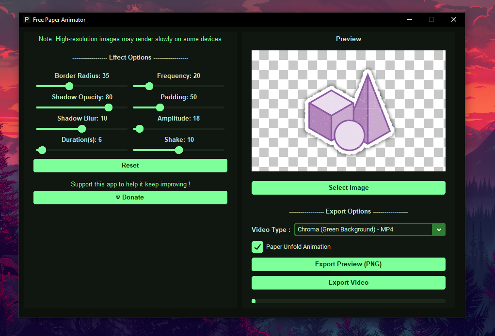

# Free Paper Animator

**Free Paper Animator** is a powerful and easy-to-use tool for transforming any PNG image into stunning paper animation effects. With flexible export options and a variety of customization features, it is perfect for content creators, designers, and motion graphics enthusiasts.

---

## 🎨 Features

- **Paper Animation Effects**: Turn any PNG image into realistic paper movements.
- **Flexible Export Options**:
  - Green Screen Video (transparent background)
  - MOV Video (transparent)
  - Single-frame PNG export
- **Customization Options**:
  - Border Radius: Smooth your corners
  - Shadow Options: Add depth to your paper
  - Shake: Apply subtle motion effects
  - Padding: Adjust spacing around the content
  - Paper Unfold Animation: Create realistic unfolding paper effects
- **User-Friendly Interface**: Simple and intuitive, no technical expertise required.

---

## 💻 System Requirements

- Windows 10 / 11 (64-bit)
- Sufficient storage for exported files
- No need to install Python or dependencies — standalone executable

---

## 🚀 How to Use

1. Open **Free Paper Animator.exe**.
2. Select a PNG image from your computer.
3. Adjust animation and visual options (shadow, shake, border radius, etc.).
4. Export your work as:
   - Transparent Green Screen Video
   - MOV Video (Transparent)
   - Single-frame PNG image

---

## 📸 Screenshot

---

## 📥 Download / Releases

Download the latest executable from the **Releases** section.  
- Make sure to check the version tag (e.g., `v1.0`).  
- Preview images or GIFs may be provided to demonstrate the effects.

---

## 💖 Support / Donations

If you enjoy using **Free Paper Animator** and would like to support its development, you can make a donation here:

[Donate](https://ko-fi.com/chaouki_dev)

Every contribution helps improve the software and keep it free for everyone!

---
## 🔖 Tags / Keywords

`PNG, paper animation, free animator, video export, green screen, transparent video, animation tool, motion graphics, visual effects`

